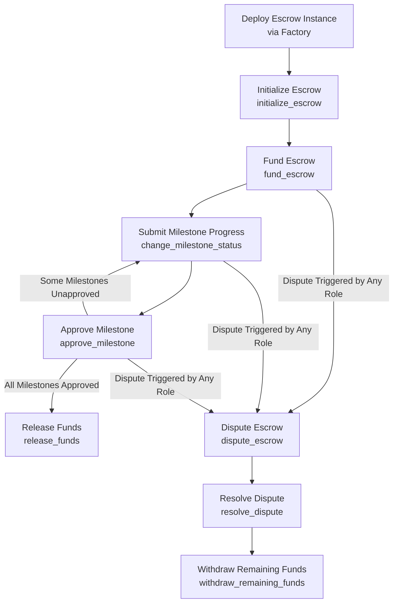

# Soroban Escrow Contract Reference

This document provides a technical reference for the on-chain Soroban escrow contract (located in `contracts/escrow`). It details the contract interface, lifecycle, storage model, roles, events, error codes, and testing procedures.

---

## 1. Contract Overview & Lifecycle

The contract implements a **single-release milestone-based escrow** system. It uses a factory-instance pattern where new escrow contracts can be dynamically deployed and managed.

### Escrow Factory vs. Instance
* **Factory Deployment (`tw_new_single_release_escrow`)**: Deploys a new instance of the contract using `deploy_v2` with a salt and initialization arguments. This allows platforms to dynamically spawn independent escrow instances for each transaction/engagement.
* **Escrow Instance**: An individual deployed contract configured with its own roles, milestones, and funding status.

### High-Level Lifecycle Diagram



### Reference Product Documentation
* **Escrow Lifecycle**: [WardChain Escrow Lifecycle](https://docs.trustlesswork.com/trustless-work/v2-en/introduction/technology-overview/escrow-lifecycle/release-phase)
* **Roles**: [Roles in WardChain](https://docs.trustlesswork.com/trustless-work/v2-en/introduction/technology-overview/roles-in-trustless-work)

---

## 2. Public Interface Reference

All exported functions in `EscrowContract` (`contracts/escrow/src/contract.rs`) are documented below:

| Function | Authorized Signer(s) | Preconditions | Emitted Event(s) | REST API / SDK Equivalent |
| :--- | :--- | :--- | :--- | :--- |
| `tw_new_single_release_escrow` | `signer` | The contract must not already have an escrow stored. | None (invokes init functions internally) | `/escrow/single-release/v2/deploy` (Factory part) |
| `initialize_escrow` | None (Typically Deployer) | Must not be already initialized. Flags must be false. Milestones must not be empty and <= 50. Platform fee + 0.3% WardChain fee must be <= 100%. | `InitEsc` (`tw_init`) | `/escrow/single-release/v2/deploy` (Init part) |
| `fund_escrow` | `signer` | Escrow is initialized. `amount` > 0. Provided `expected_escrow` matches current stored state exactly. `signer` has enough trustline token balance. | `FundEsc` (`tw_fund`) | `/escrow/single-release/v2/fund` |
| `release_funds` | `release_signer` | Escrow not already released/resolved. `release_signer` matches stored `roles.release_signer`. Escrow not disputed. All milestones are approved. Contract holds enough tokens. | `DisEsc` (`tw_release`) | `/escrow/single-release/v2/release` |
| `update_escrow` | `platform` | `platform` matches `roles.platform`. Escrow not disputed. Platform address cannot be changed. Flags in updated properties must be false. See property immutability below. | `ChgEsc` (`tw_update`) | `/escrow/single-release/v2/update` |
| `get_escrow` | Public Read | Escrow must be initialized. | None | `/escrow/single-release/v2/get` |
| `get_escrow_by_contract_id` | Public Read | Target contract exists and supports `get_escrow`. | None | - |
| `get_multiple_escrow_balances` | Public Read | Input address array length <= 20. | None | - |
| `extend_contract_ttl` | `platform` | `platform` matches stored `roles.platform`. | `ExtTtlEvt` (`tw_ttl_extend`) | - |
| `change_milestone_status` | `service_provider` | `service_provider` matches stored `roles.service_provider`. Valid milestone index. Status cannot be empty. | `MilestoneStatusChanged` (`tw_ms_change`) | `/escrow/single-release/v2/milestone/status` |
| `approve_milestone` | `approver` | `approver` matches stored `roles.approver`. Valid index. Milestone not already approved. Status is not empty. | `MilestoneApproved` (`tw_ms_approve`) | `/escrow/single-release/v2/milestone/approve` |
| `dispute_escrow` | Any role except Dispute Resolver | `signer` matches one of the roles (approver, provider, platform, release_signer, receiver). Escrow not disputed/resolved. | `EscrowDisputed` (`tw_dispute`) | `/escrow/single-release/v2/dispute` |
| `resolve_dispute` | `dispute_resolver` | `dispute_resolver` matches `roles.dispute_resolver`. Escrow must be disputed. Distributions length <= 50. Total distribution matches contract balance exactly. All values > 0. | `DisputeResolved` (`tw_disp_resolve`) | `/escrow/single-release/v2/dispute/resolve` |
| `withdraw_remaining_funds` | `dispute_resolver` | `dispute_resolver` matches `roles.dispute_resolver`. Escrow is released, resolved, or disputed. Total <= current balance. All amounts > 0. | None | - |

### Escrow Property Immutability in `update_escrow`
* **If Contract has Funds (Balance > 0)**: All metadata fields, roles, amount, and existing milestones are locked. The platform can **only append new unapproved milestones** (milestone index >= old milestone count) up to the limit of 50.
* **If Contract has No Funds (Balance = 0)**: Properties can be modified, but no milestone (existing or new) can be marked as approved.

---

## 3. Storage & Roles Reference

### Storage Structures (`storage/types.rs`)

#### `Escrow`
```rust
pub struct Escrow {
    pub engagement_id: String,
    pub title: String,
    pub roles: Roles,
    pub description: String,
    pub amount: i128,
    pub platform_fee: u32,
    pub milestones: Vec<Milestone>,
    pub flags: Flags,
    pub trustline: Trustline,
    pub receiver_memo: u32,
}
```

#### `Milestone`
```rust
pub struct Milestone {
    pub description: String,
    pub status: String,
    pub evidence: String,
    pub approved: bool,
}
```

### System Roles
* **`approver`**: Typically the Client. Has authority to approve milestones.
* **`service_provider`**: Typically the freelancer/worker performing the task. Submits progress updates and evidence.
* **`platform`**: The specific platform instance integrating WardChain. Receives the platform fee, can modify milestones when contract holds no funds, and can extend contract TTL.
* **`release_signer`**: An address (often a platform hot wallet or oracle) authorized to sign off and release the earnings once all milestones are approved.
* **`dispute_resolver`**: The arbiter responsible for resolving disputes. Cannot dispute the escrow themselves.
* **`receiver`**: The recipient of funds upon release (usually matches the `service_provider`).

### Fee Calculations & Limits
* **WardChain Fee**: 0.3% (30 BPS) of the total amount.
* **Platform Fee**: Configurable up to 99% (9900 BPS).
* **Limit**: The sum of `platform_fee` BPS + 30 BPS must not exceed 100% (10,000 BPS).

---

## 4. Error Code Reference

The following table lists the error codes defined in `contracts/escrow/src/error.rs`:

| Code | Variant Name | Human-Readable Message | Typical Trigger |
| :--- | :--- | :--- | :--- |
| 1 | `AmountCannotBeZero` | Amount cannot be equal to or less than zero | Escrow initialized or funded with <= 0 tokens. |
| 2 | `EscrowAlreadyInitialized` | Escrow already initialized | Calling initialize when escrow data already exists in storage. |
| 3 | `EscrowNotFound` | Escrow not found | Executing an operation on a contract instance before it is initialized. |
| 4 | `OnlyReleaseSignerCanReleaseEarnings` | Only the release signer can release the escrow earnings | Non-release signer attempts to call `release_funds`. |
| 5 | `EscrowNotCompleted` | The escrow must be completed to release earnings | Attempting to release funds when some milestones are not approved. |
| 6 | `EscrowBalanceNotEnoughToSendEarnings` | The escrow balance must be equal to the amount of earnings defined for the escrow | Contract balance is less than the escrow amount during release. |
| 7 | `OnlyPlatformAddressExecuteThisFunction` | Only the platform address should be able to execute this function | Non-platform address calls `update_escrow` or `extend_contract_ttl`. |
| 8 | `OnlyServiceProviderChangeMilstoneStatus` | Only the service provider can change milestone status | Non-provider address calls `change_milestone_status`. |
| 9 | `NoMilestoneDefined` | Escrow initialized without milestone | Initializing or releasing an escrow with an empty milestone vector. |
| 10 | `InvalidMileStoneIndex` | Invalid milestone index | Querying or updating a milestone index out of bounds. |
| 11 | `OnlyApproverChangeMilstoneFlag` | Only the approver can change milestone flag | Non-approver attempts to call `approve_milestone`. |
| 12 | `OnlyDisputeResolverCanExecuteThisFunction` | Only the dispute resolver can execute this function | Non-resolver attempts to call `resolve_dispute` or `withdraw_remaining_funds`. |
| 13 | `EscrowAlreadyInDispute` | Escrow already in dispute | Disputing an escrow that is already flagged as disputed. |
| 14 | `EscrowNotInDispute` | Escrow not in dispute | Resolving a dispute when the dispute flag is false. |
| 15 | `InsufficientFundsForResolution` | Insufficient funds for resolution | Resolving dispute with total distributions exceeding contract balance. |
| 16 | `EscrowOpenedForDisputeResolution` | Escrow has been opened for dispute resolution | Calling standard release or modification functions while in a dispute. |
| 17 | `Overflow` | This operation can cause an Overflow | Safe math additions or multiplications overflowed. |
| 18 | `Underflow` | This operation can cause an Underflow | Safe math subtraction underflowed. |
| 19 | `DivisionError` | This operation can cause Division error | Division by zero or invalid division. |
| 20 | `InsufficientApproverFundsForCommissions` | Insufficient approver funds for commissions | Internal check for fee calculation limits. |
| 21 | `InsufficientServiceProviderFundsForCommissions` | Insufficient Service Provider funds for commissions | Internal check for fee calculation limits. |
| 22 | `MilestoneApprovedCantChangeEscrowProperties` | You can't change the escrow properties after the milestone is approved | Attempting to modify properties when milestones are already approved. |
| 23 | `EscrowHasFunds` | Escrow has funds | State checking utility. |
| 24 | `EscrowAlreadyResolved` | This escrow is already resolved | Dispute resolution attempted on an already resolved escrow. |
| 25 | `TooManyEscrowsRequested` | You have requested too many escrows | Batch balance query address count > 20. |
| 26 | `UnauthorizedToChangeDisputeFlag` | You are not authorized to change the dispute flag | Address initiating dispute is not part of the escrow roles. |
| 27 | `TooManyMilestones` | Cannot define more than 50 milestones in an escrow | Initializing or updating with > 50 milestones. |
| 28 | `ReceiverAndApproverFundsNotEqual` | The approver's and receiver's funds must equal the current escrow balance. | Internal safety check for fee splits. |
| 29 | `MilestoneHasAlreadyBeenApproved` | You cannot approve a milestone that has already been approved previously | Approving an already approved milestone. |
| 30 | `EmptyMilestoneStatus` | The milestone status cannot be empty | Submitting status change with empty string. |
| 31 | `PlatformFeeTooHigh` | The platform fee cannot exceed 99% | Platform fee configured > 9900 basis points. |
| 32 | `FlagsMustBeFalse` | All flags (approved, disputed, released) must be false in order to execute this function. | Attempting initialization or forbidden updates with true flags. |
| 33 | `EscrowPropertiesMismatch` | The provided escrow properties do not match the stored escrow. | Funding request escrow structure doesn't match on-chain data. |
| 34 | `ApproverOrReceiverFundsLessThanZero` | The funds of the approver or receiver must not be less or equal than 0. | Internal check for distribution payouts. |
| 35 | `EscrowAlreadyReleased` | The escrow funds have been released. | Trying to release or dispute a released escrow. |
| 36 | `IncompatibleEscrowWasmHash` | The provided contract address is not an instance of this escrow contract. | Factory deployment / address verification mismatch. |
| 37 | `PlatformAddressCannotBeChanged` | The platform address of the escrow cannot be changed. | Attempting to modify platform role during property updates. |
| 38 | `AmountsToBeTransferredShouldBePositive` | None of the amounts to be transferred should be less or equal than 0. | Dispute distribution list contains negative/zero values. |
| 39 | `DistributionsMustEqualEscrowBalance` | The sum of distributions must equal the current escrow balance when resolving an escrow dispute. | Dispute resolver distribution mismatch. |
| 40 | `DisputeResolverCannotDisputeTheEscrow` | The dispute resolver cannot dispute the escrow. | Dispute resolver attempts to call `dispute_escrow`. |
| 41 | `TotalAmountCannotBeZero` | The total amount to be distributed cannot be equal to zero. | Total distribution for dispute resolve is zero. |
| 42 | `InsufficientFundsForEscrowFunding` | The signer has insufficient funds to fund the escrow. | Funder token balance is less than required escrow amount. |
| 43 | `MilestoneToApproveDoesNotExist` | The milestone to approve does not exist | Milestone index for approval is out of bounds. |
| 44 | `EscrowNotFullyProcessed` | The escrow must be fully processed before withdrawing remaining funds | Withdrawing remaining funds on active, non-finalized escrow. |
| 45 | `TooManyDistributions` | Cannot define more than 50 distributions when resolving dispute | Distributions map size > 50. |
| 46 | `MilestoneToUpdateDoesNotExist` | The milestone to update does not exist | Milestone index for status change is out of bounds. |

---

## 5. Events Reference

The contract publishes events for on-chain status tracking by indexers and clients:

### `InitEsc` (Topic: `tw_init`, Format: `vec`)
* Emitted when `initialize_escrow` successfully stores the escrow properties.
* **Fields**: `escrow: Escrow` (The entire initialized escrow structure).

### `FundEsc` (Topic: `tw_fund`, Format: `vec`)
* Emitted when `fund_escrow` transfers the escrow amount to the contract.
* **Fields**: `signer: Address`, `amount: i128`.

### `DisEsc` (Topic: `tw_release`, Format: `single-value`)
* Emitted when `release_funds` transfers payments and fees.
* **Fields**: `release_signer: Address`.

### `ChgEsc` (Topic: `tw_update`, Format: `vec`)
* Emitted when platform updates contract properties.
* **Fields**: `platform: Address`, `engagement_id: String`, `new_escrow_properties: Escrow`.

### `MilestoneStatusChanged` (Topic: `tw_ms_change`, Format: `vec`)
* Emitted when a milestone status/evidence is updated by the service provider.
* **Fields**: `escrow: Escrow`.

### `MilestoneApproved` (Topic: `tw_ms_approve`, Format: `vec`)
* Emitted when a milestone approved flag is updated by the approver.
* **Fields**: `escrow: Escrow`.

### `EscrowDisputed` (Topic: `tw_dispute`, Format: `vec`)
* Emitted when an escrow is disputed by an authorized signer.
* **Fields**: `escrow: Escrow`.

### `DisputeResolved` (Topic: `tw_disp_resolve`, Format: `vec`)
* Emitted when the dispute resolver resolves the dispute.
* **Fields**: `escrow: Escrow`.

### `ExtTtlEvt` (Topic: `tw_ttl_extend`, Format: `vec`)
* Emitted when contract persistent storage TTL is extended by the platform.
* **Fields**: `platform: Address`, `ledgers_to_extend: u32`.

---

## 6. Local Development & Testing

### How to Run Tests
The test suite utilizes the standard Rust testing toolchain. You must run the tests from the workspace root or the `contracts/escrow` subdirectory.

```bash
# From the repository root
cargo test

# From contracts/escrow
cargo test
```

### Test Directory Map (`contracts/escrow/src/tests`)
* **`helpers.rs`**: Setup utilities for creating mock Soroban test environments, generating mock addresses, and deploying test token instances.
* **`escrow.rs`**: Verifies factory deployment (`tw_new_single_release_escrow`), initialization (`initialize_escrow`), platform updates (`update_escrow`), and TTL extensions (`extend_contract_ttl`).
* **`fund.rs`**: Tests funding validation (`fund_escrow`), release validation (`release_funds`), standard fee calculations, and payouts.
* **`milestone.rs`**: Validates milestone state changes (`change_milestone_status`) and client approval logic (`approve_milestone`).
* **`dispute.rs`**: Covers dispute flag transitions (`dispute_escrow`), dispute resolution payouts (`resolve_dispute`), and remaining funds retrieval (`withdraw_remaining_funds`).
* **`balance.rs`**: Validates batch contract balance queries (`get_multiple_escrow_balances`).
